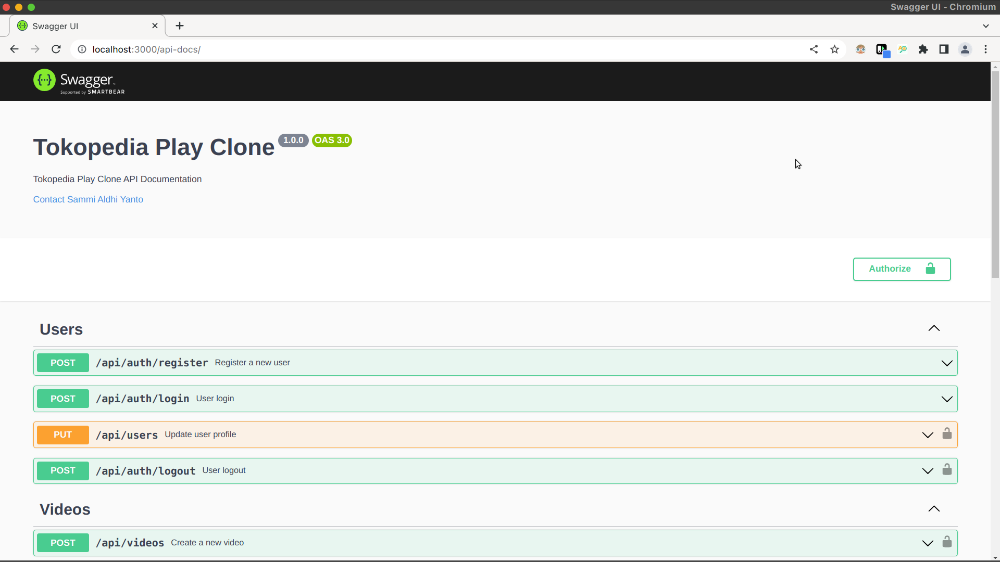
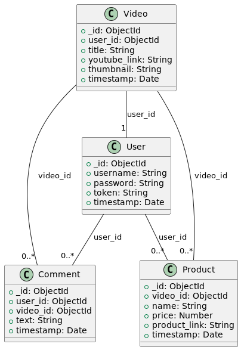

## Tokopedia Play Clone

**Tokopedia Play Clone** is a web application that is built using NodeJS, ExpressJS, and MongoDB for the backend and ReactJS for the frontend. This application is a clone of [Tokopedia Play](https://www.tokopedia.com/play/channels) in simplify version.

### Features

- [x] Live comment using Server Sent Event (SSE)
- [x] Search
- [x] User module
  - [x] Register
  - [x] Login
  - [x] Logout
  - [x] Update user profile
- [x] Video module
  - [x] Create video
  - [x] Update video
  - [x] Delete video
  - [x] Get all videos
  - [x] Get video by id
- [x] Comment module
  - [x] Create comment
- [x] Product module
  - [x] Create product
  - [x] Update product
  - [x] Delete product
  - [x] Get all products
  - [x] Get product by id
  - [x] Get all products by video id

### Additional Features
- [x] Open API documentation using Swagger
- [x] Token based authentication using uuid (not commonly used, but sufficient for this simple case study)
  - [ ] Future improvement: use JWT/Paseto instead of uuid
- [x] Logging using Winston
- [x] Authentication middleware
- [x] Simple Authorization middleware

### To Do List
- [ ] Unit testing
- [ ] Integration testing
- [ ] Dockerize the frontend
- [ ] Dockerize the backend
- [ ] Deployment & CICD

### How to install & run the app

#### Prerequisites

1. Make sure you have installed **Node.js** and **NPM** in your computer, if not please install them first in
   this [link](https://nodejs.org/en/download/)
2. Make sure you have installed **Docker** and **Docker Compose** in your computer, if not please install them first in
   this [link](https://docs.docker.com/get-docker/)
3. Make sure you have installed VSCode in your computer, if not please install it first in
   this [link](https://code.visualstudio.com/download)

#### Steps
- Clone this repository

```bash
git clone git@github.com:SemmiDev/tokopedia-play-clone.git
```
- Go to the project directory

```bash
cd tokopedia-play-clone
```

- Install the dependencies

```bash
npm install
```

- Run the mongodb container

```bash
docker-compose up -d
```

- Run the app (RESTful Server)

```bash
npm run server
```

### For test the API
You can open [http://localhost:3000/api-docs](http://localhost:3000/api-docs/) to view it in the browser.



### Database Schema



### Tech Stack

- **NodeJS** (JavaScript runtime built on Chrome's V8 JavaScript engine)
- **ExpressJS** (Fast, unopinionated, minimalist web framework for Node.js)
- **MongoDB** (Document database)
- **Bcrypt** (Password hashing function)
- **Dotenv** (Zero-dependency module that loads environment variables)
- **Mongoose** (MongoDB object modeling tool)
- **Morgan** (HTTP request logger middleware for node.js)
- **UUID** (Simple, fast generation of RFC4122 UUIDS)
- **Winston** (A logger for just about everything)
- **Validator** (A library of string validators and sanitizers)
